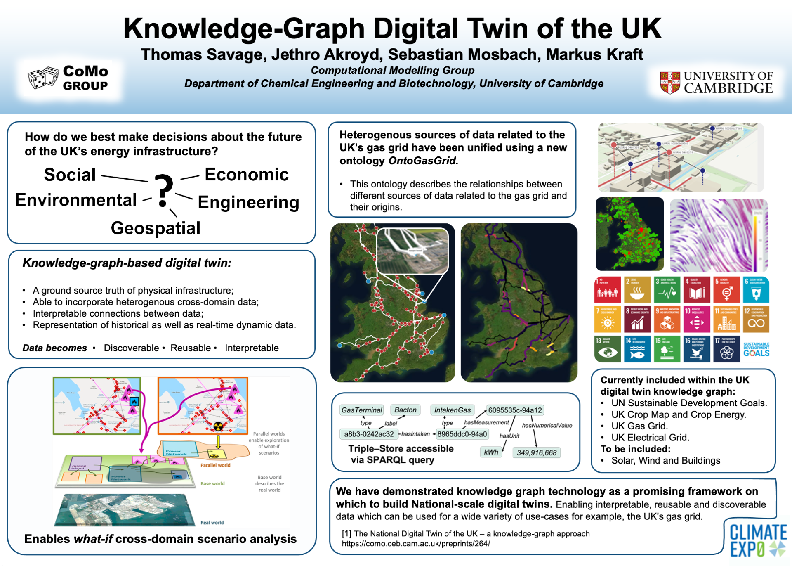

# Awards & Scholarships 

* **President's PhD Scholarship** - Imperial College London - £81,600
* **John Dudding Masters Studentship** - Fitzwilliam College, Cambridge - £10,000
* **Chemical Engineering MSc Studentship - _Declined_**- Imperial College London - £6,000
* **Best Individual Performance** - BEng Final Year Design Project - £200 
* **Ede & Ravenscroft Highly Commended Research Internship**- University of Manchester - £60 
* **Travel Scholarships for Conference Attendance** - £240  

# Invited Lectures & Oral Presentations 

* Knowledge-Graph-Based Digital Twin of the UK Gas Grid, Mitigation Solutions, Climate EXP0 

* 30th European Symposium on Computer Aided Process Engineering
* Lecture on Gaussian Processes for Real-Time Optimisation, Seoul National University 
* 3rd International Conference on Machine Learning and AI in (Bio)Chemical Engineering , University of Cambridge 
* International Federation of Automatic Control 2020 World Congress
* Process Integration Research Consortium, University of Manchester
  * First undergraduate to present in 30+ year consortium history. 
* Lecture on Stochastic Optimisation, 2nd year Chemical Engineering undergraduate course, University of Manchester
* Summer Research Internship Showcase, University of Manchester 

# Courses 
These are courses or tutorial style presentations I have previously given in group meetings.
* Gaussian Processes (4+ hours)
* [Tensorial Data Analysis (1 hour)](assets/presentations/tensorial_data_analytics.pdf)
* [Derivative Free Optimisation (4 hours)](assets/presentations/DFO_Tom_Savage.pdf)
* Stochastic Search Optimisation (2 hours)
* [Bayesian System Identification (1 hour)](assets/presentations/bayesian_system_identification.pdf)
* [Adaptive Multiscale Predictive Modelling (2 hours)](assets/presentations/ampm.pdf)

---

_Updated 04/06/2021_

